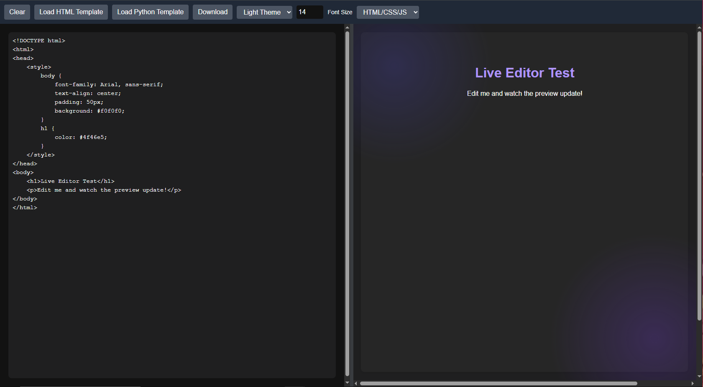
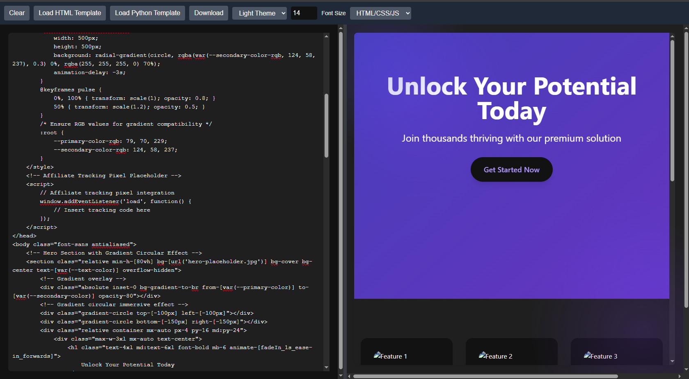

# Live Code Editor & Preview

 

A web-based code editor with live preview capabilities, supporting HTML/CSS/JavaScript and Python. Built with a sleek, modern interface using Tailwind CSS and powered by Pyodide for Python execution in the browser.

## Features

- **Dual-Pane Interface**: Edit code on the left and see a live preview on the right.
- **Language Support**:
  - HTML/CSS/JavaScript: Real-time rendering in an iframe.
  - Python: Executes code using Pyodide with output displayed in the preview pane.
- **Customizable**:
  - Switch between light and dark themes.
  - Adjustable font size (10px to 20px).
- **Interactive Tools**:
  - Clear the editor with a single click.
  - Load predefined HTML or Python templates.
  - Download your code as a `.html` or `.py` file.
- **Resizable Layout**: Drag the resizer to adjust the editor and preview pane sizes.
- **Visual Flair**: Subtle gradient animations in the preview pane for a polished look.

## Demo

Try it out by opening the `index.html` file in a modern web browser (Chrome, Firefox, Edge recommended). No server setup is required—just open and start coding!

## Usage

1. **Open the Editor**:
   - Open `index.html` in a browser.
2. **Choose a Language**:
   - Select `HTML/CSS/JS` or `Python` from the dropdown in the toolbar.
3. **Write Code**:
   - Type or paste your code into the editor pane. The preview updates automatically after a short delay.
4. **Customize**:
   - Use the toolbar to switch themes, adjust font size, clear the editor, load templates, or download your work.
5. **Resize**:
   - Drag the vertical resizer between the panes to adjust their widths.

### Example Templates
- **HTML**: Loads a styled hero section with a button.
- **Python**: Prints a simple "Hello" message and a loop.

## Technical Details

- **Frontend**: HTML, CSS (Tailwind CSS), JavaScript.
- **Python Support**: Pyodide v0.23.4, loaded from CDN, with stdout redirection for output display.
- **Styling**: Custom CSS with animations and a responsive layout.
- **Preview**: Uses an iframe for HTML rendering and a div for Python output.

## Installation

No installation is required! Simply:
1. Clone or download this repository.
2. Open `index.html` in a browser.

Ensure an internet connection for the initial load (to fetch Tailwind CSS and Pyodide).

## Limitations

- **Python**: Requires Pyodide to load, which may take a few seconds on first use. Limited to Pyodide’s capabilities (no external Python libraries beyond what Pyodide supports).
- **Security**: The iframe sandbox restricts scripts to same-origin and basic execution for safety.
- **Browser Compatibility**: Best experienced in modern browsers with JavaScript enabled.

## Contributing

Feel free to fork this project and submit pull requests! Ideas for improvement:
- Add support for more languages (e.g., JavaScript-only execution).
- Enhance Python functionality with additional libraries.
- Improve accessibility features.

## License

This project is open-source and available under the [MIT License](LICENSE).

## Credits

Built by [Your Name]. Powered by:
- [Tailwind CSS](https://tailwindcss.com/)
- [Pyodide](https://pyodide.org/)

---

Let me know if you'd like to tweak anything—such as adding your name, a specific license, or more detailed instructions!
